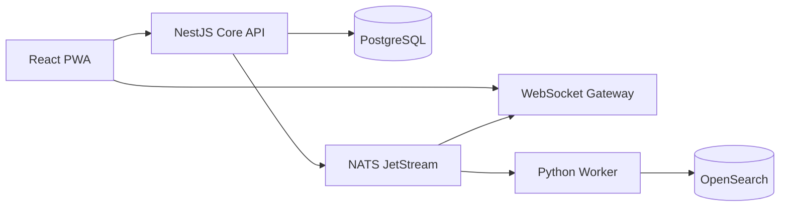

# Архитектура internal alpha

## Границы компонентов

Core API остаётся модульным монолитом: транзакции, права и доменные инварианты находятся в одном процессе. Realtime вынесен отдельно, потому что число WebSocket-соединений масштабируется независимо от REST-нагрузки. Python применяется только для асинхронной индексации и интеграций; он не дублирует доменную логику сообщений.

## Доставка сообщения

1. Auth guard создаёт `AppContext` из JWT или изолированных dev-заголовков.
2. Store проверяет членство в организации и доступ к каналу.
3. Одна PostgreSQL-транзакция резервирует `channel.sequence`, создаёт сообщение, audit event, domain event и idempotency response. Edit/delete используют optimistic revision lock; tombstone является terminal state.
4. После commit API по порядку выгружает tenant outbox в JetStream с `msgID = event.id`; tenant advisory lock сохраняет порядок cursor и commit.
5. После JetStream ack событие получает `published_at`. Незавершённые события автоматически перепубликуются после сбоя или рестарта; несовместимое legacy-событие крупнее безопасного NATS payload явно помещается в quarantine и остаётся доступным через `/sync`, не блокируя tenant outbox.
6. Gateway пересекает сохранённый `audienceUserIds` с актуальным доступом к каналу и при ошибке проверки ничего не отправляет.
7. Клиент дедуплицирует сущности по ID; после disconnect вызывает `/v1/sync?cursor=`.

Гарантия — at-least-once. Все consumers обязаны быть идемпотентными. PostgreSQL является единственным источником истины; OpenSearch можно полностью перестроить из event log/таблиц.

Треды хранятся как сообщения с `thread_root_id`; лента канала возвращает только корни, а thread endpoint — корень и отдельную cursor-page ответов. Реакции меняются независимо от content revision. Read state монотонно хранит последнюю прочитанную channel sequence и вычисляет unread без собственных и удалённых сообщений. После delete содержимое заменяется tombstone также в event log и сохранённых idempotency responses. OpenSearch хранит постоянный tombstone-документ без контента и применяет external revision, поэтому поздний JetStream redelivery не восстанавливает старую версию; будущие search-запросы обязаны исключать документы с `deleted_at`.

## Мультиарендность

- `tenant_id` присутствует во всех tenant-owned таблицах и событиях.
- API устанавливает `app.tenant_id` локально для каждой транзакции PostgreSQL.
- RLS является вторым барьером после обязательных application-level проверок.
- Приватный канал проверяется через `channel_memberships`; его audience вычисляется при создании события.
- Realtime и будущий search API никогда не принимают tenant/channel permissions от клиента как доверенные.

В production миграции выполняет отдельная роль-владелец, а API и worker работают под ролями без `SUPERUSER`/`BYPASSRLS`.

## Совместимость и эволюция

- REST versioning: `/v1`; breaking change создаёт `/v2`.
- Event envelope имеет `version`; consumer сначала валидирует envelope, затем payload.
- Миграции БД используют expand-contract: nullable/additive schema → dual read/write → backfill → удаление в следующем релизе.
- Cursor opaque для клиента и сейчас кодирует server sequence/event cursor.
- Desktop и mobile должны использовать сгенерированный OpenAPI client и те же Zod contracts.
