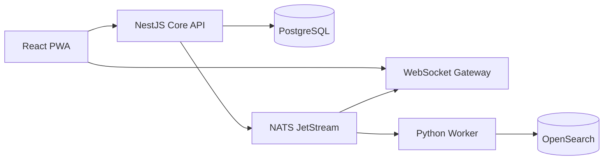

# Архитектура internal alpha

## Границы компонентов

Core API остаётся модульным монолитом: транзакции, права и доменные инварианты находятся в одном процессе. Realtime вынесен отдельно, потому что число WebSocket-соединений масштабируется независимо от REST-нагрузки. Python применяется только для асинхронной индексации и интеграций; он не дублирует доменную логику сообщений.

## Доставка сообщения

1. Auth guard создаёт `AppContext` из JWT или изолированных dev-заголовков.
2. Store проверяет членство в организации и доступ к каналу.
3. Одна PostgreSQL-транзакция резервирует `channel.sequence`, создаёт сообщение, audit event, domain event и idempotency response.
4. После commit API публикует event в JetStream с `msgID = event.id`.
5. После JetStream ack событие получает `published_at`. Незавершённые события автоматически перепубликуются после рестарта.
6. Gateway отправляет event только пользователям из `audienceUserIds`.
7. Клиент дедуплицирует сущности по ID; после disconnect вызывает `/v1/sync?cursor=`.

Гарантия — at-least-once. Все consumers обязаны быть идемпотентными. PostgreSQL является единственным источником истины; OpenSearch можно полностью перестроить из event log/таблиц.

## Мультиарендность

- `tenant_id` присутствует во всех tenant-owned таблицах и событиях.
- API устанавливает `app.tenant_id` локально для каждой транзакции PostgreSQL.
- RLS является вторым барьером после обязательных application-level проверок.
- Приватный канал проверяется через `channel_memberships`; его audience вычисляется при создании события.
- Realtime и будущий search API никогда не принимают tenant/channel permissions от клиента как доверенные.

В production миграции выполняет отдельная роль-владелец, а API и worker работают под ролями без `SUPERUSER`/`BYPASSRLS`.

## Совместимость и эволюция

- REST versioning: `/v1`; breaking change создаёт `/v2`.
- Event envelope имеет `version`; consumer сначала валидирует envelope, затем payload.
- Миграции БД используют expand-contract: nullable/additive schema → dual read/write → backfill → удаление в следующем релизе.
- Cursor opaque для клиента и сейчас кодирует server sequence/event cursor.
- Desktop и mobile должны использовать сгенерированный OpenAPI client и те же Zod contracts.

